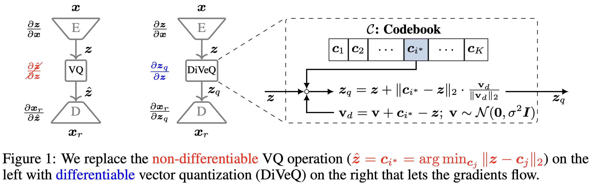

# DiVeQ: Differentiable Vector Quantization Using the Reparameterization Trick

This is the official code implementation for the paper [*"DiVeQ: Differentiable Vector Quantization Using the Reparameterization Trick"*](https://arxiv.org/abs/2509.26469) accepted at International Conference on Learning Representations (ICLR) in 2026.



**Abstract:**
Vector quantization is common in deep models, yet its hard assignments block gradients and hinder end-to-end training. We propose DiVeQ, which treats quantization as adding an error vector that mimics the quantization distortion, keeping the forward pass hard while letting gradients flow. We also present a space-filling variant (SF-DiVeQ) that assigns to a curve constructed by the lines connecting codewords, resulting in less quantization error and full codebook usage. Both methods train end-to-end without requiring auxiliary losses or temperature schedules. In VQ-VAE image compression, VQGAN image generation, and DAC speech coding tasks across various data sets, our proposed methods improve reconstruction and sample quality over alternative quantization approaches.

> [!TIP]
> To use DiVeQ as vector quantizer in your model, you can use the provided `diveq` [PyPI package](https://pypi.org/project/diveq/) that is installable by running `pip install diveq`. For more details and documentation, please look into the package.

> [!NOTE]
> In its simplest form, DiVeQ is also available as part of the popular [vector-quantize-pytorch](https://pypi.org/project/vector-quantize-pytorch/) package (by setting `directional_reparam=True`).


# VQ-VAE Image Compression

## Create the Conda Environment for VQ-VAE Compression

Create the environment by passing the following in your terminal in the following order.

```bash
conda create --name vqvae_comp python=3.13.3
conda activate vqvae_comp
pip install -r vqvae_comp_reqs.txt
```

## Train VQ-VAE model

First, change directory to `vqvae_compression`

```bash
cd vqvae_compression
```

Train the VQ-VAE model:

```bash
python train.py
```

# VQGAN Image Generation

## Create the Conda Environment for VQGAN Generation

Create the environment by passing the following in your terminal in the following order.

```bash
conda create --name vqgan_gen python=3.13.3
conda activate vqgan_gen
pip install -r vqgan_gen_reqs.txt
```

## Train VQGAN model

First, change directory to `vqgan_generation`

```bash
cd vqgan_generation
```

1. Train the generator (VQ-VAE) model (first stage training):

```bash
python training_vqgan.py
```

2. Train the transformer model (second stage training):

```bash
python training_transformer.py
```

3. Sample from transformer to create new generations:

```bash
python sample_transformer.py
```

4. Compute FID metric between original data and generated samples:

```bash
python compute_fid.py
```

# Repository List of Contents

## VQVAE Directory

- `train.py`: code to train the VQ-VAE model
- `model.py`: code for VQ-VAE encoder and decoder
- `diveq.py`: code to optimize the codebook by DiVeQ
- `sf_diveq.py`: code to optimize the codebook by SF-DiVeQ
- `diveq_detach.py`: code to optimize the codebook by Detach variant of DiVeQ
- `sf_diveq_detach.py`: code to optimize the codebook by Detach variant of SF-DiVeQ
- `residual_diveq.py`: code to optimize the codebook by Residual VQ using DiVeQ
- `residual_sf_diveq.py`: code to optimize the codebook by Residual VQ using SF-DiVeQ
- `product_diveq.py`: code to optimize the codebook by Product VQ using DiVeQ
- `product_sf_diveq.py`: code to optimize the codebook by Product VQ using SF-DiVeQ
- `vq.py`: code to optimize the codebook using other VQ baseline methods

## VQGAN Directory

- `training_vqgan.py`: code to train the VQ-VAE model
- `training_transformer.py`: code to train the transformer
- `sample_transformer.py`: code to generate images from trained VQGAN
- `compute_fid.py`: code to compute the FID score
- `encoder.py`: contains the code for VQ-VAE encoder
- `decoder.py`: contains the code for VQ-VAE decoder
- `discriminator.py`: contains the code for the discriminator model used for training VQ-VAE
- `vqgan.py`: contains the code to build the VQ-VAE model with the encoder, vector quantization, and decoder
- `transformer.py`: contains the code to build the transformer model
- `mingpt.py`: contains the code for GPT model
- `helper.py`: contains some utility blocks used in building the models such as GroupNorm, ResidualBlock
- `utils.py`: contains some utility functions like codebook replacement
- `diveq.py`: code to optimize the codebook by DiVeQ
- `sf_diveq.py`: code to optimize the codebook by SF-DiVeQ
- `diveq_detach.py`: code to optimize the codebook by Detach variant of DiVeQ
- `sf_diveq_detach.py`: code to optimize the codebook by Detach variant of SF-DiVeQ
- `vq.py`: code to optimize the codebook using other VQ baseline methods


## Citation

```
@InProceedings{vali2026diveq,
    title={{DiVeQ}: {D}ifferentiable Vector Quantization Using the Reparameterization Trick},
    author={Vali, Mohammad Hassan and Bäckström, Tom and Solin, Arno},
    booktitle={International Conference on Learning Representations (ICLR)},
    year={2026}
}
```

## License
This software is provided under the MIT License. See the accompanying [LICENSE](LICENSE.txt) file for details.
